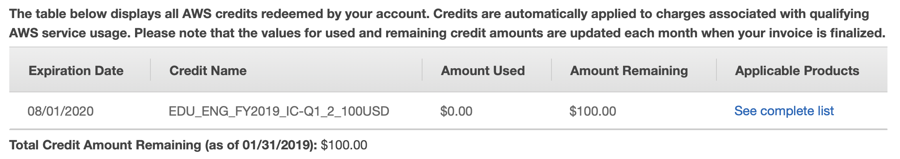
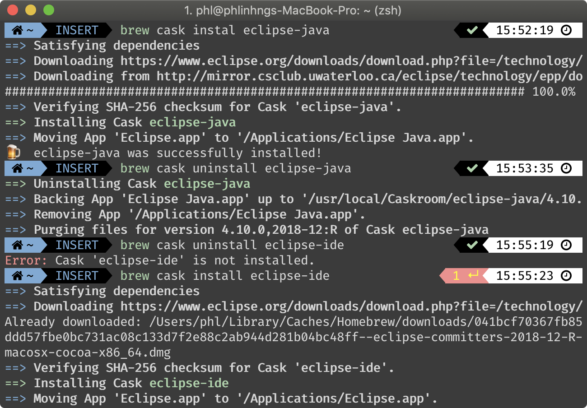
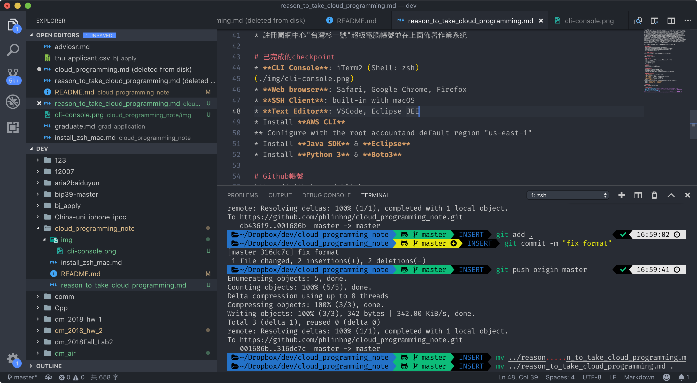
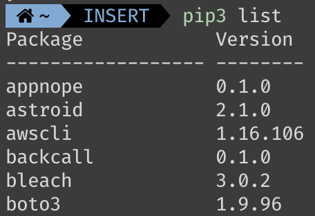
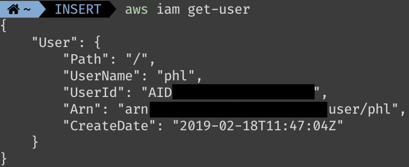
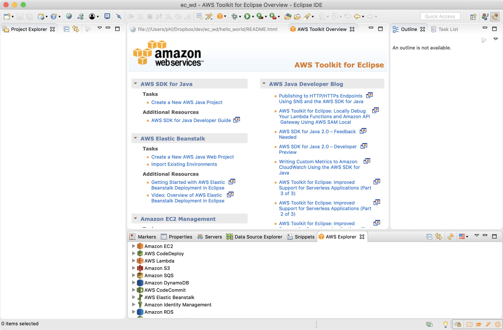

以下是我想修這門課的理由和我目前掌握的電腦技能，供老師參考。

# 想修課的理由
1. 對課程有興趣，且有相關先備知識可以完成課程
2. 修過陳宜欣老師Data Mining，欲了解更多雲程式方面的知識
3. 化工背景，修過程序控制，想知道IOT和Sensor的進階應用
4. 即將畢業，想在畢業前修到課

# 曾學過的資工系課程
線性代數、資料結構、演算法、作業系統、資料探勘與應用

# 曾學過的程式語言
R、Matlab、C++、Python

# 電腦操作技術
* 使用homebrew（macOS的apt-get）管理libraries、架設環境
* 使用terminal指令
* 使用git進行版本控制
* 熟練嘸蝦米輸入法

# 外語能力
托福90 足以看懂大部分英語ocument

# 雲平台相關經驗
* 曾用過AWS、VPS供應商的服務自架VPN
* 曾用Google Computing Platform佈署VM
* 註冊國網中心"台灣杉一號"超級電腦帳號並在上面佈署作業系統

# 己完成的checkpoint
* Sign up for an AWS Account an redeem the student credit    
* 
* **CLI Console**: iTerm2 (Shell: zsh)    

* **Web browser**: Safari, Google Chrome, Firefox    
* **SSH Client**: built-in with macOS
* **Text Editor**: VSCode, Eclipse JEE    

* Install **AWS CLI**    
    
* Configure with the root accountand default region "us-east-1"    

* Install **Java SDK** & **Eclipse**    
    
See also [雲端程式設計開發環境安裝筆記](https://github.com/phlinhng/cloud_programming_note/blob/master/README.md)
* Install **Python 3** & **Boto3**    

# Github帳號
https://github.com/phlinhng

# 有利審查的附件
+ [Data Mining課堂作業1](https://github.com/phlinhng/dm_2018_hw_1)
+ [Data Mining課堂作業2](https://www.kaggle.com/phlinhng/dm-hw2-103032027)
+ [雲端程式設計開發環境安裝筆記](https://github.com/phlinhng/cloud_programming_note/blob/master/README.md)

